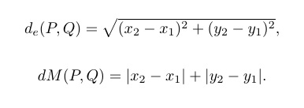
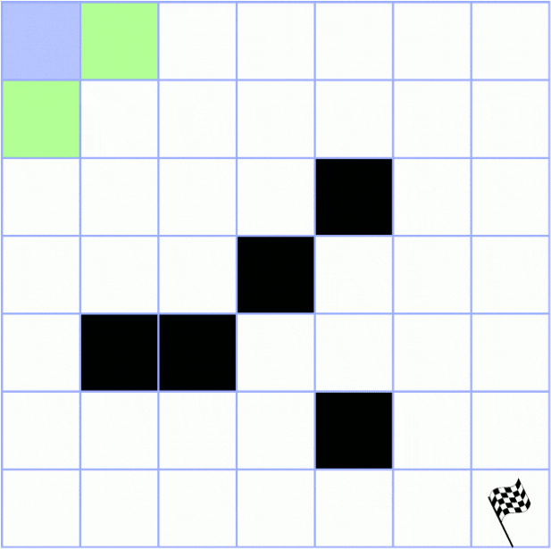
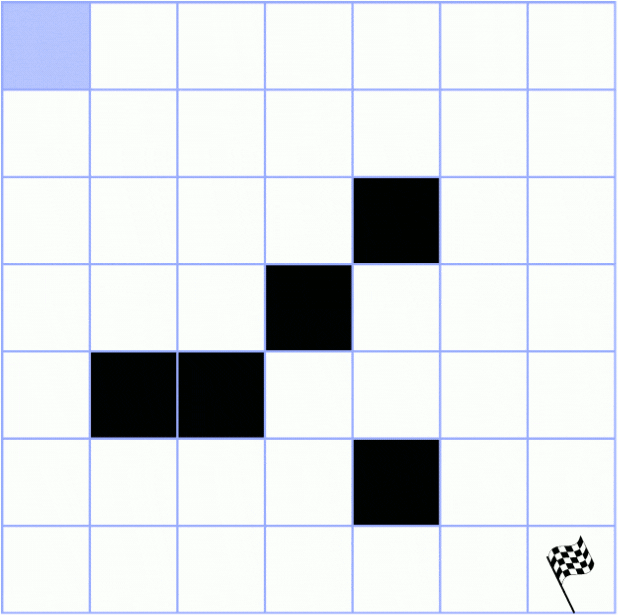
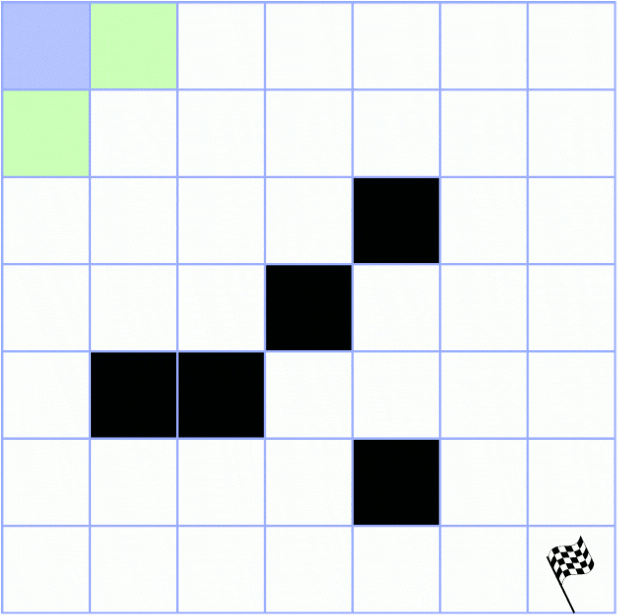
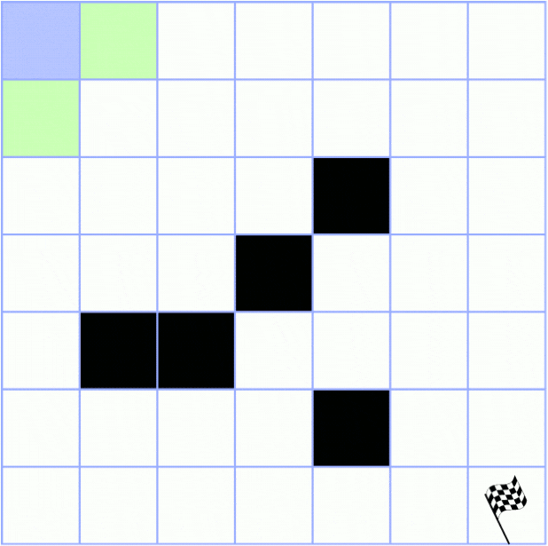
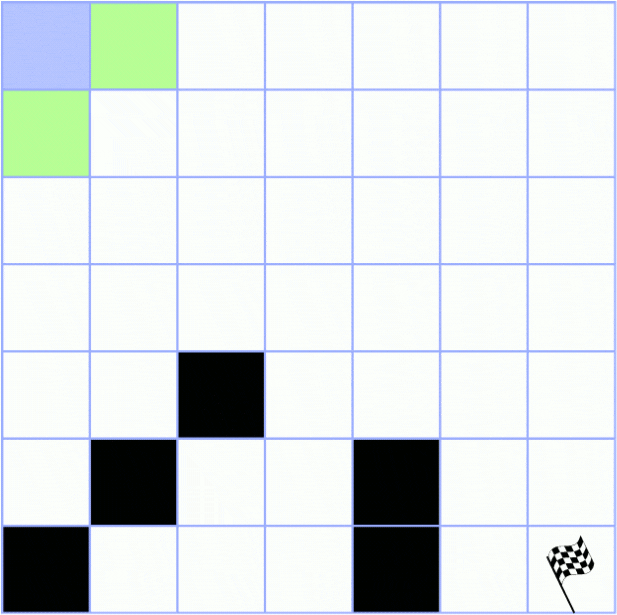
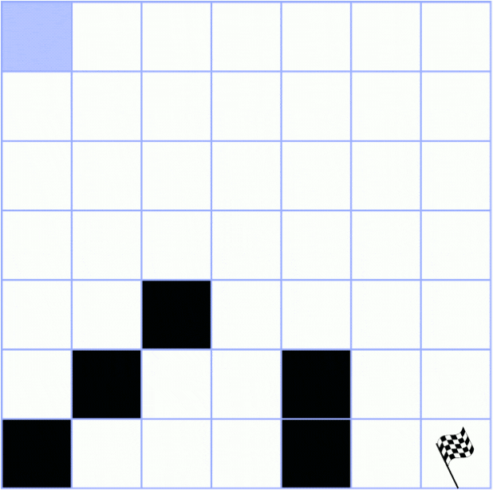
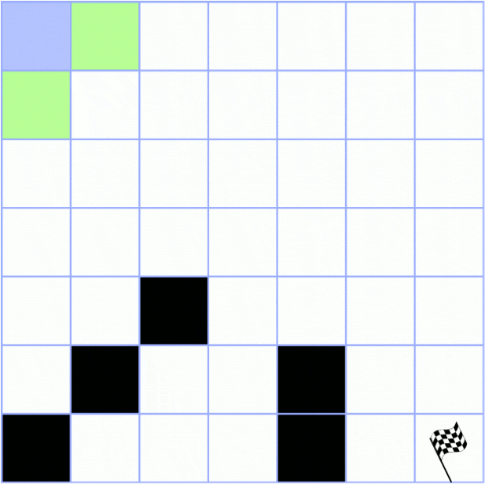
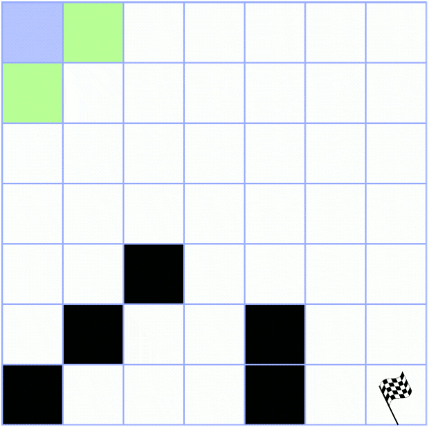

# Labirinto II

## Exercício

<p align="justify">Atividade avaliativa sobre o caminhamento em labirinto. Nesta atividade, cada dupla de alunos deve entregar um trabalho contemplando o algoritmo A* com as opções de Distância Euclidiana e Distância Manhattan. A dupla deste algoritmo é composta por <a href="https://github.com/ppinheirosiqueira">Pedro Pinheiro</a> e <a href="https://github.com/JoaoMEspindola">João Pedro Espíndola</a>.</p>

<p align="justify">O labirinto em si é uma matriz quadrada de tamanho N e o objetivo é partir da coordenada inicial (0,0) até a coordenada final (N-1,N-1). Esta matriz possuirá barreiras, que são meramente coordenadas que não podem ser visitadas.</p>

<p align="justify">Neste trabalho o método utilizado se chama A*. Este método é uma variação do método BFS (Breadth-First Search), também conhecido como Busca em Largura. Além de utilizar este método, será realizada uma comparação do resultado deste algoritmo com os métodos BFS e DFS. A dupla que realizou este trabalho possui uma explicação destes métodos citados <a href="https://github.com/ppinheirosiqueira/BFS-DFS">neste link</a>.</p>

<p align="justify">O A* pode ser explicado como uma 'melhoria' do BFS, pois em sua estrutura terá cálculos de distância das posições da matriz para que o destino final seja acessado de maneira mais rápida. Neste exemplo, as distância utilizidas serão Euclidana e Manhattan. Segue abaixo as fórmulas utilizadas para os cálculos:</p>

<p align="center"></p>

## Entrada

<p align="justify">Para o programa funcionar é necessária uma única entrada do usuário. Ela se dá por meio de um arquivo chamado <b>input.txt</b>. Este arquivo deve estar na pasta principal do programa junto do makefile. Além disso, ele possui uma formatação própria bem simples e que serve como base para a criação da matriz que os algoritmos serão executados.</p>

<p align="justify">Essa formatação se dá por duas etapas, a primeira é um único número logo na primeira linha do arquivo. Este número irá representar o tamanho da matriz que o usuário deseja que o algoritmo rode. Para os exemplos que vamos testar depois o tamanho da matriz será 7, logo, a primeira linha do nosso arquivo será 7:</p>

```
7
```

<p align="justify">Com esta única linha o programa já rodará criando uma matriz 7x7 sem nenhum tipo de barreira.</p>

<p align="justify">E esta será a primeira entrada testada para todos os métodos:</p>

<p align="center"></p>

<p align="justify">A segunda etapa é a introdução das barreiras. Para isso, a partir da segunda linha do arquivo, coloque o par de coordenadas que se deseja criar uma barreira. Esta coordenada deve levar em conta o próprio tamanho da matriz, além de que estamos usando um programa que trabalha com o valor inicial (0,0). Então em uma matriz 7x7, como a do exemplo, a maior coordenada possível é (6,6). Qualquer coordenada com um valor maior que o limite da primeira linha ou menor que 0 provocará erros na execução do programa. Para a introdução desta coordenada é necessário simplesmente que coloque a coordenada do eixo X, uma vírgula, a coordenada do eixo Y. Para a introdução de novas barreiras, sempre coloque na próxima linha, sendo uma barreira nova por linha. A entrada que será testada no nosso exemplo será esta:</p>

```
7
0,4
1,4
2,2
2,5
4,1
4,4
5,5
6,1
6,3
```

<p align="justify">Assim, a segunda matriz de entrada em nosso teste é:</p>

<p align="center"></p>

<p align="justify">Para uma comparação mais rica, outros testes foram realizados, porém, aqui nesta documentação serão expostos dois casos chaves, onde podemos mostrar melhor os pontos positivos e negativos de cada distância aplicada. Para isso, outras duas entradas foram testadas, sendo elas:</p>

```
7
4,1
4,2
3,3
2,4
5,4
```
<p align="justify">Assim, a terceira matriz de entrada em nosso teste é:</p>

<p align="center"></p>

```
7
4,2
5,1
5,4
6,0
6,4
```
<p align="justify">Assim, a quarta matriz de entrada em nosso teste é:</p>

<p align="center"></p>


## Programação
<p align="justify">Este algoritmo não possui muita diferença da base criada no BFS. Ou seja, nosso algoritmo utilizou como base os códigos disponibilizados pelo professor, de <a href="https://github.com/mpiress/dynamic_queue">Fila dinâmica</a> para o BFS, e, <a href="https://github.com/mpiress/dynamic_stack">Pilha dinâmica</a> para o DFS. Além do próprio <a href="https://github.com/ppinheirosiqueira/BFS-DFS">algoritmo feito pela dupla</a>.</p>

<p align="justify">Para que fosse possível ordenar as filas pelas distãncias, foi necessário que os Itens que eram Enfileirados ou Empilhados possuisem este valor de Distância, que assim foi incluso como um Float. Apesar da inclusão deste número, tanto os métodos de BFS quanto DFS não o utilizaram. Nas opções envolvendo A*, a distância seria calculada a depender de qual fosse o caso e aí sim o item era enfileirado.</p>

<p align="justify">Para tal ordenação da fila, utilizou-se o método Bubble Sort, por ser um método de fácil aplicação e que precisará ordenar poucas coisas em muita quantidade, o que o torna extremamente útil. Portanto, este método foi implementado da seguinte forma: Criou-se um vetor de <code>Itens</code> que terá as distâncias calculadas pelo algoritmo sendo assim, ordenado. Um <code>Bloco</code> auxiliar que preencherá o vetor antes da ordenação e após a ordenação será atualizado direto na fila. E por último um <code>Item</code> auxiliar que ajudará na implementação do Bubble Sort.</p>

<p align="justify">Para ilustração do nosso algoritmo, segue abaixo um gif para cada método de busca, contemplando as diferenças de cada um para acessar o destino final. No gif, a cor azul representa as posições atuais, a vermelha as posições enfileiradas/empilhadas, a cinza os vértices desempilhados no DFS e posições ignoradas pelos cálculos de distância no A*, e, por último a verde que representa as posições futuras do BFS e a conclusão no destino final. Tendo em vista que a segunda matriz ja foi ilustrada <a href="https://github.com/ppinheirosiqueira/BFS-DFS">aqui</a>, e a primeira matriz não possui obstáculos foram feitas ilustrações apenas das duas últimas.</p>

### Terceira Matriz

<p float="left">




</p>


### Quarta Matriz

<p float="left">




</p>
  
## Saída

<p align="justify">O programa agora possui um menu de escolha, onde o usuário pode escolher se deseja rodar a matriz de entrada no BFS, DFS, A* com Distância Euclidiana ou A* com Distância Manhattan. A saída para qualquer opção é igual a apresentada no <a href="https://github.com/ppinheirosiqueira/BFS-DFS">algoritmo base</a> já citado algumas vezes nessa discussão.</p>
  
<p align="justify">Com as matrizes postas em Entradas, possuímos o seguinte conjunto de saídas:</p>

| Método                      |  Entrada 1     | Entrada 2        | Entrada 3      | Entrada 4      |
| ----------------------------| ---------------|------------------|--------------- |--------------- |
|  BFS                        |       49       |       37         |       44       |       44       |
|  DFS                        |       13       |       15         |       13       |       21       |
|  A* - Distância Euclidiana  |       24       |       20         |       28       |       23       |
|  A* - Distância Manhattan   |       23       |       21         |       21       |       29       |

<p align="justify">Analisando a quantidade de inserções na Fila ou Pilha, podemos concluir algumas coisas. A primeira, é que o método de Fila puro é o pior, por possuir uma liberdade de movimento muito grande, o BFS acaba realizando uma quantidade de inserções na Fila muito maior do que os outros algoritmos. Outro ponto importante, é que mesmo com métodos de Fila melhores que o BFS, como os apresentados pelos algoritmos A*, o DFS demonstrou ser o que precisa da menor quantidade de inserções para chegar ao seu objetivo final. Ainda nos algoritmos puros, é possível reparar que o BFS, apresenta o seu pior caso justamente em situações onde não existem barreiras, pois todos os pontos da matriz seriam varridos pelo código, enquanto o DFS se torna pior a depender das barreiras.</p>

<p align="justify">Analisando agora os dois algoritmos A*, é possível ver que para uma entrada vazia ou para uma entrada mais dispersa, que ambos apresentam um comportamento quase que igual, onde um "venceu" na Entrada 1 e o outro "venceu" na Entrada 2, ambas as vitórias com uma única inserção na Lista de diferença. No entanto, a depender dos obstáculos, é possível que um método aumente em muito a vantagem que possuem de um contra o outro. Pela natureza que ambos os algoritmos possuem, é perceptível que o método que utiliza a distância Euclidiana possui uma desvantagem caso as barreiras se concentrem no meio da matriz, enquanto o método que utiliza a distância Manhattan possui uma desvantagem caso as barreiras se concentrem nas bordas da matriz.</p>

# Compilação e Execução

<p align="justify">O exercício disponibilizado possui um arquivo Makefile cedido pelo professor que realiza todo o procedimento de compilação e execução. Para tanto, temos as seguintes diretrizes de execução:</p>


| Comando                |  Função                                                                                           |                     
| -----------------------| ------------------------------------------------------------------------------------------------- |
|  `make clean`          | Apaga a última compilação realizada contida na pasta build                                        |
|  `make`                | Executa a compilação do programa utilizando o gcc, e o resultado vai para a pasta build           |
|  `make run`            | Executa o programa da pasta build após a realização da compilação                                 |

<p align="justify">É recomendado fazer um <code>make clean</code> antes de um <code>make</code>.</p>
